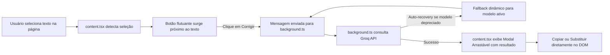

# 📋 Review Completa & Roadmap de Evolução — Corretor IA Groq

Este documento consolida a análise técnica profunda, auditoria de experiência do usuário (UX), pontos de melhoria e o roadmap de funcionalidades para a extensão **Corretor IA Groq**.

---

## 📑 Sumário
1. [Visão Geral e Arquitetura](#1-visão-geral-e-arquitetura)
2. [Auditoria dos Componentes Atuais](#2-auditoria-dos-componentes-atuais)
3. [Pontos de Melhoria (Técnicos, UX e Segurança)](#3-pontos-de-melhoria)
4. [Roadmap de Novas Funcionalidades](#4-roadmap-de-novas-funcionalidades)
5. [Plano de Implementação Recomendado](#5-plano-de-implementação-recomendado)

---

## 1. Visão Geral e Arquitetura

O **Corretor IA Groq** é uma extensão para navegadores baseados no Chromium (Google Chrome, Brave, Edge, etc.) desenvolvida sob a especificação **Manifest V3**.

### Stack Tecnológica:
- **Framework Base:** [Plasmo Framework](https://www.plasmo.com/) (otimizado para extensões modulares MV3).
- **Core UI:** React 19 + TypeScript.
- **Sistema de Design:** [Ant Design](https://ant.design/) (v5/v6) com algoritmo nativo de Dark Mode (`theme.darkAlgorithm`).
- **Ícones:** Lucide React (`lucide-react`) e Ant Design Icons (`@ant-design/icons`).
- **Motor de Inteligência Artificial:** [Groq Cloud API](https://console.groq.com/) (Chat Completions via LPU Inference).

### Fluxo de Funcionamento:

---

## 2. Auditoria dos Componentes Atuais

| Arquivo | Responsabilidade | Pontos Fortes | Oportunidades Identificadas |
| :--- | :--- | :--- | :--- |
| [`src/background.ts`](file:///c:/Users/vinig/dev/GitHub/corretor-ia-groq/src/background.ts) | Service Worker MV3, orquestração de mensagens, chamadas à API da Groq. | Auto-recuperação de modelos descontinuados; auto-descoberta via `/openai/v1/models`. | Resposta bloqueante (sem streaming SSE); falta de cache local de respostas repetidas. |
| [`src/content.tsx`](file:///c:/Users/vinig/dev/GitHub/corretor-ia-groq/src/content.tsx) | Script injetado em `<all_urls>` para capturar seleções e renderizar UI. | Modal arrastável com clamp de viewport; isolamento de Shadow DOM Plasmo; atende inputs, textareas e contentEditable. | Sem diff visual das palavras alteradas; pode perder estilos em editores ricos avançados. |
| [`src/popup.tsx`](file:///c:/Users/vinig/dev/GitHub/corretor-ia-groq/src/popup.tsx) | Painel rápido de acesso ao clicar no ícone da extensão. | Dark mode refinado sem margens brancas; atalhos rápidos para Configurações e Testes. | Falta validação de formato da chave (`gsk_...`); teste imediato de conectividade. |
| [`src/options.tsx`](file:///c:/Users/vinig/dev/GitHub/corretor-ia-groq/src/options.tsx) | Página completa de configurações e personalização de tom/modelos. | Tags com status de modelos; botão para descobrir modelos ativos da conta; seleção de tons. | Poderia incluir gerenciador de lista de sites ignorados (blacklist) e histórico. |
| [`src/tabs/test.tsx`](file:///c:/Users/vinig/dev/GitHub/corretor-ia-groq/src/tabs/test.tsx) | Playground interativo para testar diferentes tipos de campos de texto. | Permite testes rápidos de inputs simples, textareas e editores ricos simulados. | Espelha com fidelidade as ações do content script para testes unitários manuais. |

---

## 3. Pontos de Melhoria

### 3.1. Visualização de Diferenças (Diff Highlight)
- **Problema:** A ferramenta exibe o texto resultante completo. Quando o usuário corrige uma frase de 30 palavras onde apenas uma crase ou vírgula foi alterada, é difícil identificar o que mudou.
- **Solução:** Implementar um comparador de diff inline (destacando termos removidos em vermelho/tachado e termos adicionados em verde).

### 3.2. Tratamento de Formatação Rich Text
- **Problema:** Em editores ricos (ex: Notion, Slack Web, Google Docs, Gmail), substituir via `insertText` pode descartar negritos, itálicos, links ou quebras de parágrafo.
- **Solução:** Utilizar técnicas de preservação de nós de texto no `Range` da seleção ou emitir eventos de clipboard simulados (`ClipboardEvent` com payload HTML).

### 3.3. Streaming de Resposta (Server-Sent Events)
- **Problema:** Textos longos aguardam a conclusão completa do modelo antes de exibir o resultado.
- **Solução:** Configurar `stream: true` na API da Groq e transmitir tokens em tempo real via portas do Chrome (`chrome.runtime.connect`), criando o efeito de digitação instantânea.

### 3.4. Lista de Exclusão de Sites (Blacklist / Whitelist)
- **Problema:** O botão flutuante pode surgir em sites indesejados (como jogos em navegador, Figma, planilhas pesadas ou editores de código web como VS Code / GitHub Codespaces).
- **Solução:** Permitir nas configurações configurar uma lista de domínios ignorados onde o Content Script permanece inativo.

### 3.5. Validação Prévia da Chave da API
- **Problema:** Se o usuário colar uma chave com espaços ou formato incorreto, o erro só aparecerá ao tentar corrigir um texto.
- **Solução:** Validação regex (`^gsk_[a-zA-Z0-9]{20,}$`) no popup e teste automático de ping assim que a chave for inserida.

---

## 4. Roadmap de Novas Funcionalidades

### 🟢 Nível 1: Produtividade Imediata (Alto Impacto)

#### 1. Atalho de Teclado Global (`Keyboard Shortcuts`)
- **Descrição:** Acionar a correção diretamente pela tecla de atalho (ex: `Alt + C` ou `Ctrl + Shift + K`), sem necessidade de clicar no botão flutuante.
- **Ação Rápida:** Pressionar `Enter` com a janela aberta substitui imediatamente o texto no campo.

#### 2. Menu de Contexto do Chrome (Botão Direito)
- **Descrição:** Adicionar a opção `"Corrigir com IA (Groq)"` ao menu de contexto de seleções no navegador (`chrome.contextMenus`).
- **Benefício:** Permite corrigir textos mesmo em páginas que bloqueiam ou interceptam eventos de seleção do mouse.

#### 3. Ações Rápidas de IA no Próprio Modal (One-Click Chips)
- **Descrição:** Adicionar botões no topo do modal de sugestão:
  - ⚡ **Encurtar / Resumir:** Deixar a frase mais concisa e direta.
  - 📝 **Expandir:** Detalhar a ideia mantendo boa coesão.
  - 💼 **Mudar Tom:** Alternar entre *Profissional* e *Casual* com 1 clique, sem precisar ir às opções.
  - 🌐 **Traduzir:** Traduzir imediatamente para Inglês ou Espanhol com correção gramatical nativa.

---

### 🟡 Nível 2: Inteligência e Aprendizado

#### 4. Dicas Gramaticais / "Por que foi corrigido?"
- **Descrição:** Um acordeão retrátil ou tooltip explicando o motivo da mudança (ex: *"Crase obrigatória antes de palavra feminina"*, *"Concordância: sujeito plural exige verbo no plural"*).
- **Benefício:** Agrega valor pedagógico e constrói confiança no produto.

#### 5. Dicionário Pessoal / Palavras Ignoradas
- **Descrição:** Painel nas configurações onde o usuário cadastra termos técnicos, marcas, jargões ou nomes próprios que a IA não deve tocar ou "corrigir".

#### 6. Histórico Local de Correções
- **Descrição:** Armazenamento das últimas 30 correções realizadas em `chrome.storage.local`.
- **Benefício:** Se o usuário acidentalmente fechar uma aba ou sobrescrever um texto e perder o histórico de desfazer (`Ctrl+Z`), pode resgatá-lo com facilidade.

---

### 🟣 Nível 3: Polimento de Interface & Métricas

#### 7. Métricas de Escrita e Velocidade
- **Descrição:** Exibir estatísticas no rodapé da janela:
  - Exemplo: `85 palavras • 3 erros corrigidos • Latência: 120ms`

#### 8. Modo Silencioso / Auto-Replace
- **Descrição:** Para usuários avançados: ao disparar o atalho, a IA faz a correção e já substitui no campo imediatamente, disparando apenas um toast discreto de sucesso.

---

## 5. Plano de Implementação Recomendado

### 🎯 Fase 1 — Produtividade & Clareza (Próxima Iteração)
1. **Diff Visual:** Implementar exibição comparativa no modal (destaque em verde/vermelho).
2. **Atalho de Teclado:** Registrar comando de atalho no manifest e acionamento no content script.
3. **Menu de Contexto:** Adicionar integração com o botão direito no `background.ts`.

### 🎯 Fase 2 — Flexibilidade & Controle
4. **Chips de Ação Rápida:** Adicionar atalhos de "Resumir", "Expandir" e "Mudar Tom" no cabeçalho do modal.
5. **Blacklist de Domínios:** Permitir desativar a extensão em páginas específicas.
6. **Streaming de Resposta:** Integrar Server-Sent Events para respostas progressivas.

### 🎯 Fase 3 — Recursos Avançados
7. **Dicionário Pessoal:** Gestão de palavras reservadas.
8. **Histórico de Correções:** Armazenamento e consulta no popup.
9. **Explicações Gramaticais:** Geração de notas pedagógicas sobre os erros encontrados.

---

*Documento gerado em 15/09/2026 para o projeto `corretor-ia-groq`.*
